# Jacky Kit　何智傑

**Scientist & Creative Polymath** · Hong Kong

*Curiosity first. Precision always.*　好奇為先，精準為本。

從 8088 個人電腦開始拆系統，到今天自建 GPU 上跑 AI Agent。開發只是好奇心的副產品。

[Website](https://jackykit.com/) · [About](https://jackykit.com/about) · [Projects](https://jackykit.com/projects) · [Music](https://jackykit.com/music) · [Blog](https://jackykit.com/blog) · [Photography](https://jackykit.com/photography)

---

## 正在做　Now

香港為基地，把物理、Unix、語言模型、粵語與音樂放在同一條工作線上。先有可驗算的方法，才有界面。

| 專案 | 做什麼 | 連結 |
| :--- | :--- | :--- |
| **Astronomy.HK** | 香港夜空的天文・物理互動資料平台。自研 JK 指數家族，三語（繁中／英／日），不報沒有誤差範圍的數字。 | [astronomy.hk](https://astronomy.hk/) |
| **writer.hk** | 中文寫作與發布平台。背後是自建粵語填詞語義詞庫 JKSL——語義、粵音、押韻、協音、語域。 | [writer.hk](https://writer.hk/) |
| **Cheese Cat** | JK AI Agent 的公開敘事介面。自建 GPU 7×24，不是模擬儀表板。 | [cheesecat.net](https://cheesecat.net/) |
| **Cheese Frontier** | 全球 LLM 交叉基準。多源取中位數，每 4 小時自動更新 Cheese Index。 | [models.cheesecat.net](https://models.cheesecat.net/) |
| **JK Labs LLM Dashboard** | 即時推理監控：Prompt、Response、Stdout、GPU 熱力與 VRAM。 | [llm-dashboard.3jk.net](https://llm-dashboard.3jk.net/) |
| **JK Quant Trading** | AI 驅動量化平台。本地 LLM 與自主 Agent 產生可解釋訊號。 | [trading-dashboard](https://trading-dashboard.jackykit.com/) |
| **JK AI Hub** | 一個 OpenAI 相容閘道，接 200+ 模型。 | [aihub.jk.hk](https://aihub.jk.hk/) |
| **JK Music** | 原創歌曲：作曲、填詞、製作、混音皆獨立完成，發行至全球串流。 | [Music](https://jackykit.com/music) |

完整專案年表（1997–2026）見 [jackykit.com/projects](https://jackykit.com/projects)。

---

## 關於　About

17 歲做出香港早期交友網站之一；此後二十年在 Unix 基礎設施、高流量系統、產品工程與區塊鏈之間來回。2016 年起認真做鏈上系統；近年把同一套「先建可信數據與可複現方法」用在 LLM 評測、粵語詞典與天文計算。

Development is a byproduct of curiosity. I started on an 8088 PC, built one of Hong Kong's earliest dating sites at 17, and have spent two decades between Unix infrastructure, high-traffic platforms, blockchain, and research. Today that means self-hosted agents, reproducible model evaluation, a Cantonese lexicon, and verifiable sky data — plus original music released under my own name.

**五條工作線**

- **Engineering** — 全端系統、Unix／雲架構、高流量與多租戶，從裸機到 GPU 節點
- **Intelligence** — AI Agent、LLM 基準、本地推論（llama.cpp / vLLM）、MCP、RAG
- **Language** — writer.hk 與 JKSL 粵典：用科學方法對待中文寫作
- **Science** — Astronomy.HK：可版本化的演算法、公開誤差、可審計計算路徑
- **Creative** — JK Music、攝影與作曲：原創作品公開發行

---

## 足跡　Milestones

| 年 | | |
| :---: | :--- | :--- |
| **2026** | Astronomy.HK · writer.hk · Cheese Cat / Frontier · JK Music | 天文資料、粵典、Agent 敘事、原創發行 |
| **2025** | JK AI Hub | 200+ 模型 API 整合閘道 |
| **2022** | memenetwork.io | Web3 / MEME Chain |
| **2016** | jk.hk | 創業工具集；開始認真研究區塊鏈 |
| **2013** | JK NET | 走向國際 |
| **2007** | Say.la | 社交網絡 |
| **2005** | Piano | 25 歲開始學鋼琴 |
| **2001** | 3HOME | 香港主要新聞組／NNTP 服務之一 |
| **1998** | JK NET | 域名、主機、站長工具；至今仍在營運 |
| **1997** | Love Club | 17 歲做出香港早期交友網站 |

---

## 技術棧　Stack

實際在用、而且有公開成品可查的工具。沒有自評百分比。

**Systems**  
`Unix` `Linux` `FreeBSD` `Nginx` `Apache` `Docker` `Cloudflare` `AWS`

**Languages**  
`Python` `TypeScript` `JavaScript` `PHP` `Perl` `Shell` `Solidity` `SQL`

**Data & AI**  
`MySQL` `MongoDB` `llama.cpp` `vLLM` `MCP` `RAG` `GGUF`

**Web & Chain**  
`React` `Next.js` `Node.js` `Cosmos` `EVM` `Tokenomics`

---

## 連結　Connect

想看完整作品集、音樂或攝影，請先去官網。合作與討論歡迎來信。

- 官網　[jackykit.com](https://jackykit.com/)
- 關於　[jackykit.com/about](https://jackykit.com/about)
- 電郵　[mail@jackykit.com](mailto:mail@jackykit.com)
- LinkedIn　[jacky-kit](https://www.linkedin.com/in/jacky-kit-6541b640/)
- X　[@kitjacky](https://x.com/kitjacky)
- Instagram　[@jackykit](https://www.instagram.com/jackykit)
- Medium　[jackykit.medium.com](https://jackykit.medium.com)
- ENS　`jackykit.eth`

  
  
   
  

